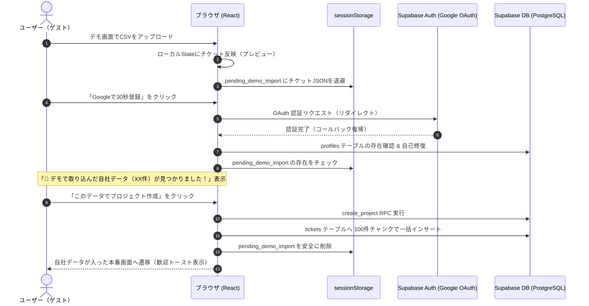

個人開発でWebサービスやSaaSを作っていると、「まずは登録不要で触ってもらうデモ機能」を導入することが多いと思います。

しかし、実際にアクセスログを分析していて直面したのが以下の課題でした。

> **「デモで自分の手元データ（CSV等）を取り込んで試してくれたユーザーが、いざ『無料でアカウント作成』を押した瞬間に、さっき取り込んだはずのデータが画面から綺麗に消えてしまう」**

デモ環境は通常、モックのメモリ上やローカルステートで動いているため、新規登録して正式なユーザーセッションが確立された瞬間に「初期状態（チケット0件）」のクリーンなDBが読み込まれ、ユーザーが苦労して取り込んだデータが消滅してしまいます。

せっかく興味を持ってデータを投入してくれた最重要見込みユーザーに「また最初からやり直してください」と強いるのは、致命的な離脱ポイントです。

この記事では、**「登録不要のデモ体験で投入されたデータを、Google OAuth等のリダイレクトを挟んでも安全に保持し、会員登録直後の本番プロジェクトへ自動インポートする設計パターン」**をまとめました。

---

## 全体のアーキテクチャとデータフロー

全体の流れを Mermaid で可視化すると以下のようになります。



---

## ぶつかった3つの壁と解決アプローチ

### 1. OAuth リダイレクトで React のインメモリ状態が吹き飛ぶ問題

メールアドレスとパスワードによるインライン登録であれば、React の親コンポーネントの state や context に保持したまま処理を完了できます。

しかし、CVR を高めるために **Google 1クリックログイン（OAuth）** を導入すると、一度外部サイト（Google）へリダイレクトして戻ってくるため、SPA の JavaScript メモリ空間は完全にリセットされます。

#### 解決策: `sessionStorage` によるタブ限定の一時退避
`localStorage` だとブラウザを閉じても残り続け、別ユーザーでログインしたときに意図せず混入する恐れがあります。
一方、`sessionStorage` であれば「現在開いているタブの生存期間中」に限定してデータが保持されるため、OAuth リダイレクトを経由しても安全にデータを復元できます。

```typescript
// デモでCSVが取り込まれた瞬間に sessionStorage に退避
const handleApplyDemoTickets = (newTickets: Ticket[]) => {
  setTickets(newTickets);
  setHasImportedDemoCsv(true);

  try {
    sessionStorage.setItem('taski_pending_demo_import', JSON.stringify({
      tickets: newTickets,
      count: newTickets.length,
      savedAt: new Date().toISOString(),
    }));
  } catch (e) {
    console.warn('Failed to save demo tickets to sessionStorage:', e);
  }
};
```

---

### 2. サインアップ直後のオンボーディング画面で引き継ぎをオプトインにする

ログイン復帰後、裏で勝手に全データを投入してしまうと、「デモで試した適当なデータだから本番には入れたくない」というユーザーが困惑します。

そこで、プロジェクト作成（オンボーディング）画面の最上部に、**「引き継ぎ可能な自社データが見つかりました」**という専用カードを表示し、ユーザーが納得してワンクリックで進められる UX にしました。

```tsx
// ProjectOnboarding.tsx
{pendingDemo && (
  <div className="p-4 bg-gradient-to-br from-emerald-500/10 via-sky-500/10 to-transparent border border-emerald-500/30 rounded-xl space-y-3">
    <div className="flex items-start justify-between">
      <div className="flex items-center gap-2.5">
        <FileSpreadsheet className="w-5 h-5 text-emerald-600" />
        <div>
          <span className="text-[10px] font-bold bg-emerald-100 text-emerald-700 px-1.5 py-0.5 rounded">
            引き継ぎ可能
          </span>
          <h3 className="font-bold text-sm text-slate-900">
            デモで取り込んだ自社データ（{pendingDemo.count}件）
          </h3>
        </div>
      </div>
      <button onClick={handleDiscardPendingDemo} title="破棄する">
        <Trash2 className="w-4 h-4 text-slate-400 hover:text-rose-500" />
      </button>
    </div>
    <p className="text-xs text-slate-600">
      デモ体験時にインポートしたチケットを引き継いで本番プロジェクトを作成できます。
    </p>
    <button
      onClick={() => setMode('create')}
      className="w-full py-2.5 bg-emerald-600 hover:bg-emerald-500 text-white font-bold text-xs rounded-lg shadow flex items-center justify-center gap-2"
    >
      <Sparkles className="w-3.5 h-3.5" />
      このデータを取り込んでプロジェクト作成へ
    </button>
  </div>
)}
```

---

### 3. 大量データの一括インサートと Supabase のペイロード制限

ユーザーが手元の業務ツール（Redmine や JIRA、Backlog 等）からエクスポートした CSV には、数百件〜数千件のチケットが含まれていることがあります。

これをそのまま 1 回の `supabase.from('tickets').insert(...)` で送ると、リクエストボディの上限やタイムアウトに引っかかる危険があります。

#### 解決策: 100件単位のチャンク分割インサート
プロジェクト作成関数（`createProject`）の中で、チケット配列を 100件ずつのチャンクに分割し、順次投入するパイプラインを実装しました。

```typescript
// ProjectContext.tsx
if (initialTickets && initialTickets.length > 0 && currentUser) {
  try {
    const ticketsToInsert = initialTickets.map((t) => ({
      project_id: newProjectId,
      title: t.title || '無題のチケット',
      description: t.description || '',
      status: t.status || 'open',
      priority: t.priority || 'medium',
      created_by: currentUser.id,
      assignee_id: t.assignee_id || currentUser.id,
      checklist: t.checklist || [],
      due_date: t.due_date || null,
    }));

    const CHUNK_SIZE = 100;
    for (let i = 0; i < ticketsToInsert.length; i += CHUNK_SIZE) {
      const chunk = ticketsToInsert.slice(i, i + CHUNK_SIZE);
      const { error: insertError } = await supabase.from('tickets').insert(chunk);
      if (insertError) {
        console.error('Chunk insert error:', insertError);
        break;
      }
    }
  } catch (e) {
    console.warn('Failed to insert initial demo tickets:', e);
  }
}
```

登録完了後は `sessionStorage.removeItem('taski_pending_demo_import')` を実行して、二重インポートを確実に防止します。

---

## 引き継ぎ完了時の「成功体験」演出（トースト）

DB への投入が完了して本番画面に遷移した際、ユーザーに対して「ちゃんと引き継がれたのか？」という不安を残さないよう、画面右下に歓迎トーストを表示します。

```tsx
// 引き継ぎ完了トースト
{importSuccessToast && (
  <aside className="fixed bottom-6 right-6 z-50 max-w-sm bg-slate-900 text-white border border-emerald-500/40 rounded-2xl p-4 shadow-2xl flex items-start gap-3 animate-slideUp">
    <Sparkles className="w-5 h-5 text-emerald-400 shrink-0 mt-0.5" />
    <div>
      <h4 className="font-bold text-sm text-emerald-300">
        自社データ（{importSuccessToast.count}件）の引き継ぎが完了しました！
      </h4>
      <p className="text-xs text-slate-300 mt-1">
        デモで取り込んだチケットがクラウド上に安全に保存されました。タスクをクリックして編集や進捗管理を始めましょう！
      </p>
    </div>
  </aside>
)}
```

---

## まとめ：個人開発SaaSこそ「ユーザーの入力労力」を絶対に無駄にしない

SaaS のコンバージョン率（CVR）改善というと、LP のキャッチコピーやボタンの色の議論になりがちです。

しかし実際には、**「プロダクトを触ってくれたユーザーが、どの瞬間に一番フラストレーションを感じているか」**を観察する方が遥かにインパクトがあります。

1. **登録不要のデモで気軽に自社データを読み込ませる**
2. **「おっ、うちのタスクが綺麗に表示された！」と価値を体感してもらう**
3. **Google 1クリックで登録させ、そのデータを1件も失わずに本番へ連れていく**

このスムーズな導線を作ったことで、体験から本番利用への移行障壁を大幅に下げることができました。同じようにデモ機能を備えたプロダクトを開発されている方の参考になれば幸いです！

---

この記事の設計パターンとコードは、Redmine 互換のモダンタスク管理ツール [Taski（タスキ）](https://taski-app.com/?utm_source=zenn&utm_medium=article&utm_campaign=demo_data_transfer) で実際に稼働しているものです。登録不要のデモ体験や CSV インポート・引き継ぎ導線はトップページからそのままお試しいただけます。
