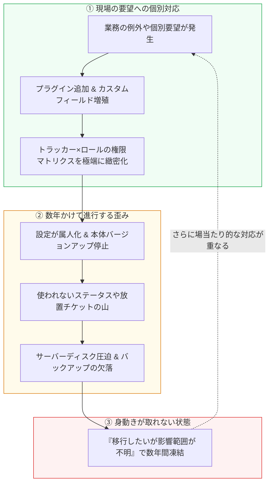

個人開発でRedmineからの移行ツールを作っていると、いろいろなチームから「うちのRedmine、実はこうなってて…」という運用の裏話を聞く機会があります。

技術的な障害というより、**「最初は良かれと思ってやったことが、数年かけてじわじわ効いてくる」** 系の話が多いのが特徴です。今回はその中でも特に再現性の高かった10個のアンチパターンと、対処のヒントをまとめます。

---

## 1. プラグイン地獄

サードパーティ製プラグインを入れすぎて、Redmine本体のバージョンアップが事実上不可能になっているケース。プラグインの多くは開発が個人ベースで、本体の新バージョンへの追従が止まっていることも珍しくありません。

**対策**: プラグインを入れる時点で「このプラグインが更新されなくなったら困るか」を評価基準に入れる。可能なら本体標準機能＋カスタムフィールドで代替できないか先に検討する。

## 2. バックアップが「とりあえずDBダンプ」止まり

`mysqldump` や `pg_dump` は日次で取っているが、添付ファイル（`files/` ディレクトリ）のバックアップが漏れているケース。いざサーバー障害で復旧が必要になったときに、チケットの本文や履歴は戻るのに添付画像や設計資料だけ全滅します。

**対策**: バックアップ対象に添付ファイルのディレクトリを必ず含める。また、別環境でのリストア訓練（復旧テスト）を一度も実施していないバックアップは「無いもの」として扱う。

## 3. カスタムフィールドの無秩序増殖

「この案件だけ特別な項目が欲しい」「このトラッカーだけ別の管理番号を入れたい」を積み重ねた結果、似て非なるカスタムフィールドが50個近く並んでいるケース。チケット作成画面が縦に果てしなく伸び、入力側も「どれを埋めればいいか分からない」状態になります。

**対策**: 新しいカスタムフィールドを追加する前に、既存フィールドの転用・命名統一・プロジェクト限定化で対応できないか確認するフローを設ける。定期的に未使用のカスタムフィールドを棚卸しする。

## 4. 権限設計をロールごとに作り込みすぎて誰も把握していない

「トラッカー × ロール × ステータス遷移」の権限マトリクスを緻密に作り込んだ結果、当時の設計者しか全体像を理解できない状態になっているケース。担当者が異動や退職をすると、誰一人として権限変更に手を出せなくなります。

**対策**: 権限設計は「ルールでガチガチに縛る」より「シンプルに保つ」ことを優先する。複雑な例外は個別チケットの運用ルールでカバーし、権限マトリクス自体は最小限のロールとステータスに留める。

## 5. 放置プロジェクトの山

終わったプロジェクトをアーカイブせず放置し続けた結果、プロジェクト一覧が数百件に膨れ上がり、検索性や一覧性が著しく低下しているケース。横断検索したときに、数年前の化石チケットが大量にヒットしてノイズになります。

**対策**: プロジェクトのクローズ・アーカイブ運用ルールを最初から決めておく。「案件終了後◯ヶ月でアーカイブ」のような機械的な運用ルールが機能しやすい。

## 6. 管理者の属人化

RedmineサーバーのOSアップデート、Ruby/Railsのバージョンアップ、SSL証明書の更新、プラグイン設定が、特定の1人のインフラ担当・エンジニアにしか分からない状態になっているケース。その人が退職・異動すると、簡単なメンテナンスすらできずブラックボックス化します。

**対策**: 運用手順書を「その人が明日いなくなっても回る」レベルでコード化（Docker/IaC化）またはドキュメント化し、最低限の運用作業をチーム内で持ち回り・共有しておく。

## 7. 添付ファイルでディスクを圧迫していることに気づかない

チケットに画像、大容量ログ、動画ファイルを気軽に添付し続けた結果、サーバーのディスク使用量がじわじわ増加し、ある日突然ディスクフル（Disk Full）でDBやサービス全体が停止するケース。

**対策**: サーバーのディスク使用率アラートを設定する。また、添付ファイルのサイズ上限（`添付ファイルサイズ制限` 設定）を適切に設けるか、古いプロジェクトの添付ファイルだけ外部ストレージへ退避する運用を敷く。

## 8. ワークフロー（ステータス）が増殖して形骸化

「もう少し細かく進捗を可視化したい」とステータスを追加していった結果、15種類以上に増え、実際にはほとんどのメンバーが「新規」「進行中」「解決」「終了」の3〜4種類しか使い分けていない、という形骸化が起きているケース。

**対策**: 定期的にステータスごとのチケット件数を集計し、過去3ヶ月〜半年で一度も使われていないステータスは統廃合する。ステータスを増やすのではなく、タグやチェックリストで細分化する方が形骸化を防ぎやすい。

## 9. チケット番号のURL参照がドキュメント各所にハードコードされている

社内Wiki、Slack、Teams、スプレッドシート、議事録などに `https://redmine.internal/issues/1234` のような直リンクが大量に埋め込まれており、別ツールへの移行やサーバー再構築の際に「これらが全てリンク切れになる」ことに着手してから初めて気づくケース。

**対策**: 移行や再構築を検討し始めた段階で、旧URL参照が生き続ける仕組み（旧番号でのリダイレクトや、移行先での旧ID検索互換）を要件に入れておく。

## 10. 「そのうち移行しよう」で3年経つ

上記のような課題を認識していながら、「今は忙しいから」「動いてはいるから」と先送りを続け、気づけば3年経っているケース。実はこれが現場で一番多く聞く「失敗」です。月日が経つほどデータが蓄積し、プラグインは古くなり、移行の腰がさらに重くなります。

**対策**: 完璧な移行計画を最初から立てようとせず、まず1つの小規模プロジェクトや新規案件だけを試験的にモダンなツールで動かしてみる。「実際に動くもの」を体験してから全体移行のロードマップを描く方が、圧倒的にスムーズに進みます。

---

## チェックリスト：あなたのRedmineは大丈夫？

| 項目 | 危険度 | チェックポイント |
|---|:---:|---|
| **プラグイン** | 高 | 開発停止したプラグインが3つ以上入っている |
| **バックアップ** | 最高 | 添付ファイル（files/）のバックアップを取っていない、またはリストアしたことがない |
| **カスタムフィールド** | 中 | 入力欄が多すぎて、未入力（空欄）だらけになっている |
| **権限・ステータス** | 中 | ステータスが10個以上あり、使い分けの基準が曖昧になっている |
| **ディスク容量** | 高 | サーバーのディスク残容量のアラート監視をしていない |
| **放置データ** | 中 | 終了したプロジェクトがアーカイブされずに一覧に残っている |
| **管理体制** | 高 | Redmineのサーバーメンテができる人が社内に1人しかいない |

---

## まとめ

技術的な失敗よりも、「小さな個別最適の積み重ねが、数年後に重い負債として効いてくる」タイプの失敗が圧倒的に多い、というのが多くの相談を通じて感じたことです。

どれも今すぐ致命傷になるわけではないからこそ、後回しにされがちです。もし1つでも心当たりがあれば、それが「そろそろ運用の棚卸しをするサイン」かもしれません。

### 自社Redmineの放置状況をチェックしたい場合
上記の「放置プロジェクトの山」「期限切れチケットの滞留」が実際に自社でどれくらい発生しているか気になった方向けに、RedmineのCSVをアップロードするだけで期日超過率・長期放置率を瞬時に可視化できる無料診断ツールを公開しています（サーバー送信ゼロ・ブラウザ完結・登録不要）。

👉 [プロジェクト健全性診断を試す（無料・登録不要）](https://taski-app.com/tools/project-health-check?utm_source=zenn&utm_medium=article&utm_campaign=unyou_failures)

### プラグイン不要・シンプルで迷わないタスク管理を体験したい場合
「プラグインのメンテから解放されたい」「Redmineのカンバンやガントチャートの良さは残しつつ、チーム全員が直感的に動かせるツールにしたい」という方向けに、モダンなタスク管理ツール **Taski** を開発しています。登録不要・1クリックでダミーデータ付きのデモ画面が起動しますので、ぜひ操作感を触ってみてください。

👉 [Taski デモを試す（登録不要・1秒で起動）](https://taski-app.com/demo?utm_source=zenn&utm_medium=article&utm_campaign=unyou_failures)
