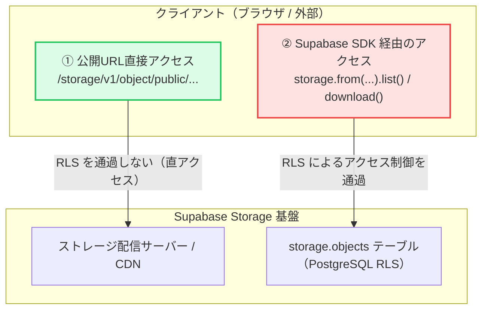

課題管理SaaS「[Taski（タスキ）](https://taski-app.com/?utm_source=zenn&utm_medium=article&utm_campaign=storage_security)」を個人開発・運用している中で、**思わず背筋が凍るセキュリティ設定の不備**を発見し、緊急対応しました。

結論から言うと、**「RLSポリシー名に `authenticated` と書いて安心していたが、SQLに `TO` 句を書いていなかったため、未ログインの誰でもフロントエンドの anon キーを使って全添付ファイルの一覧取得や削除が可能な状態になっていた」** というものです。

さらに調査を進めると、**「Supabase Storage における Public バケットと RLS（行レベルセキュリティ）の役割の混同」** がこの穴を生んだ根本原因でした。

同じように Supabase を使ってサービスを作っている個人開発者やスタートアップのエンジニアに向けて、何が起きていたのか、なぜその穴が生まれたのか、そしてどうやって修正したのかの全容をシェアします。

---

## 1. 発見した時の状態：何が起きていたのか

ある日、プロジェクトのセキュリティ設定と Supabase の使用量（Storage や Database のクォータ）を再点検していたとき、`storage.objects` テーブルの RLS ポリシー一覧を見て凍りつきました。

```sql
SELECT policyname, roles, cmd, qual, with_check
FROM pg_policies 
WHERE schemaname = 'storage' AND tablename = 'objects';
```

返ってきた結果がこちらです。

| policyname | roles | cmd | qual / with_check |
| :--- | :--- | :--- | :--- |
| Allow authenticated read attachments | `{public}` | SELECT | `(bucket_id = 'ticket-attachments')` |
| Allow authenticated insert attachments | `{public}` | INSERT | `(bucket_id = 'ticket-attachments')` |
| Allow authenticated delete attachments | `{public}` | DELETE | `(bucket_id = 'ticket-attachments')` |

お気づきでしょうか。

ポリシー名には堂々と **`Allow authenticated ...`（認証済みユーザーのみ許可）** と書かれているのに、PostgreSQL が認識している適用対象ロール（`roles`）は **`{public}`** になっています。

PostgreSQL において、`public` ロールとは **「未ログインの匿名ユーザー（anon）を含むすべてのロール」** を指します。

### これにより可能だった攻撃シナリオ
Supabase のフロントエンド用 `anon key` は、SPA（React など）のブラウザ用 JavaScript バンドル内に平文で含まれています（これは Supabase のアーキテクチャ上、正常な仕様です）。

しかし、上記の設定になっていた場合、攻撃者はブラウザのコンソールを開いて以下のコードを1行実行するだけで：

```javascript
// ブラウザのコンソールで誰でも実行可能だった
const { data, error } = await supabase.storage
  .from('ticket-attachments')
  .list(); // 全ファイル一覧が丸見え！

console.log(data); // 他の全ユーザーがアップロードしたファイル名・パスが丸見えに
```

1. **バケット内の全ファイルパス・ファイル名の一覧を根こそぎ取得できる**
2. **一覧から得たファイルパスを元に、全添付ファイルをダウンロードできる**
3. **`supabase.storage.from('...').remove(['...'])` で任意のファイルを他人のものでも削除できる**
4. **バケットサイズ上限が未設定だったため、無制限にファイルをアップロードしてストレージ枠を食いつぶせる**

まさに「全開放」状態でした。

---

## 2. なぜこの穴が生まれたのか？ 2つの落とし穴

なぜこんな設定になってしまっていたのか。原因を分析したところ、**Supabase 特有の2つの落とし穴**にハマっていたことがわかりました。

### 落とし穴①：PostgreSQL の `CREATE POLICY` は `TO` 句を省略すると `TO public` になる

初期構築時、セットアップ用のマイグレーション SQL で次のように書いていました。

```sql
-- 危険な書き方（TO 句が抜けている）
CREATE POLICY "Allow authenticated read attachments" 
ON storage.objects
FOR SELECT 
USING (bucket_id = 'ticket-attachments');
```

人間はポリシー名に `"Allow authenticated ..."` と書いた時点で「認証済みユーザー用だな」と錯覚してしまいます。しかし、PostgreSQL はポリシー名の中身なんて一切解釈しません。

`TO` 句を明示的に指定しなかった場合、PostgreSQL の構文規則により **自動的に `TO public` として扱われます**。

認証済みユーザーだけに絞るには、以下のように **`TO authenticated`** を明記しなければならなかったのです。

```sql
-- 正しい書き方
CREATE POLICY "ticket_attachments_select_authenticated" 
ON storage.objects
FOR SELECT 
TO authenticated -- これが必須！
USING (bucket_id = 'ticket-attachments');
```

### 落とし穴②：「Public バケット」と「Storage RLS」の役割の混同

もう1つの大きな勘違いは、**「画像を Web ページ上に表示するためには、`FOR SELECT` ポリシーで未ログイン（public）にも読み取りを許可しなければいけない」と思い込んでいたこと**です。

ここが Supabase Storage の最大の初見殺しポイントです。



上記のように、Supabase Storage には2つのルートが存在します。

1. **公開 URL による直接アクセス (`/storage/v1/object/public/...`)**:
   バケットが Public 設定（`public: true`）になっている場合、この URL に対する GET リクエストは **データベースの RLS を一切通りません**。Web サーバー/CDN から直接バイナリが返されます。
2. **SDK / API 経由のオブジェクト操作 (`list()`, `download()`, `remove()`)**:
   こちらは `storage.objects` テーブルに対する PostgreSQL クエリとして処理されるため、**RLS が厳密に適用されます**。

つまり、**「チケット詳細画面で画像を `` で表示する」だけであれば、`FOR SELECT` の RLS ポリシーをパブリックに開放する必要は全くなかった**のです。

`FOR SELECT` を全開放していたせいで、「画像の直リンク表示ができる」だけでなく、「バケット内の全ファイル名リストをページングしながら全件スクレイピングできる」という致命的な副産物を生んでしまっていました。

---

## 3. どう修正したか？（多層防御の適用）

この問題を解決するため、以下の4点を反映したマイグレーション SQL を作成し、本番環境に即座に適用しました。

```sql
BEGIN;

-- 1. バケットの1ファイル上限を 20MB に設定（ストレージ枯渇攻撃の防止）
UPDATE storage.buckets
SET file_size_limit = 20 * 1024 * 1024
WHERE id = 'ticket-attachments';

-- 2. 一覧取得・SDK download は認証済みユーザー（authenticated）のみに限定
DROP POLICY IF EXISTS "Allow public read attachments" ON storage.objects;
DROP POLICY IF EXISTS "ticket_attachments_select_authenticated" ON storage.objects;
CREATE POLICY "ticket_attachments_select_authenticated" ON storage.objects
  FOR SELECT 
  TO authenticated
  USING (bucket_id = 'ticket-attachments');

-- 3. 削除も認証済みユーザー（authenticated）のみに限定
DROP POLICY IF EXISTS "Allow authenticated delete attachments" ON storage.objects;
DROP POLICY IF EXISTS "ticket_attachments_delete_authenticated" ON storage.objects;
CREATE POLICY "ticket_attachments_delete_authenticated" ON storage.objects
  FOR DELETE 
  TO authenticated
  USING (bucket_id = 'ticket-attachments');

-- 4. アップロードは「ゲストのデモ体験」を維持するため anon も許可（実態に合わせてポリシー名を修正）
DROP POLICY IF EXISTS "Allow authenticated insert attachments" ON storage.objects;
DROP POLICY IF EXISTS "ticket_attachments_insert_anon_and_authenticated" ON storage.objects;
CREATE POLICY "ticket_attachments_insert_anon_and_authenticated" ON storage.objects
  FOR INSERT 
  TO anon, authenticated
  WITH CHECK (bucket_id = 'ticket-attachments');

COMMIT;
```

### 修正のポイント

#### ① `SELECT` と `DELETE` を `TO authenticated` に制限
これにより、未ログインの攻撃者がフロントエンドの anon キーを使って `supabase.storage.from(...).list()` を実行しても、空の配列 `[]` が返り、ファイル一覧を盗み出すことは完全に不可能になりました。他人のファイルの削除もできません。

#### ② 公開 URL による画像・PDF プレビューはそのまま動く
前述の通り、バケットが Public である限り、既存のチケット本文やコメントに埋め込まれている公開 URL（`/storage/v1/object/public/...`）による画像表示は RLS を通らないため、ユーザーの画面表示には一切影響を与えずにセキュリティを塞ぐことができました。

#### ③ ゲストデモ体験（未ログイン）とのトレードオフ
Taski では「登録不要・1秒で起動するデモ」を提供しており、未ログインの訪問者でもチケット起票や画像添付の操作感を試せるようにしています。

そのため、アップロード（`INSERT`）だけは `anon` を許可したままにしています。ただし、以下の2つの防壁を設けています。
- **バケット単位の `file_size_limit = 20MB` 設定**: 巨大ファイルによる一撃での容量圧迫を防ぐ。
- **ファイルパスの UUID 化**: ファイル名には推測困難なランダム UUID を付与しているため、アップロードされたとしても一覧取得（SELECT）が塞がれている以上、他人がそのファイルを探し当てることはできない。

---

## 4. 適用後の検証結果

SQL 適用後、実際に以下の検証を行いました。

1. **anon キーを用いた一覧取得の検証**:
   ブラウザのゲスト環境から `list()` を叩くと、以前は全ファイルが取得できていたものが、**綺麗に `[]`（0件）となり拒否される**ことを確認。
2. **既存画像の表示確認**:
   ログイン中・ゲスト閲覧問わず、既存のチケットや Wiki に貼られた添付画像がこれまで通り正常に表示される（HTTP 200）ことを確認。
3. **ログインユーザーの操作確認**:
   正規のログインユーザーであれば、チケット詳細での画像アップロード・プレビュー・削除が何不自由なく動作することを確認。

---

## 5. まとめとチェックリスト

Supabase は開発体験が非常に素晴らしく、サクサクとバックエンドを構築できます。しかし、Storage や RLS 周りは「動いているから大丈夫」と過信すると、思わぬ落とし穴があります。

ぜひ、ご自身の Supabase プロジェクトでも以下の3点をチェックしてみてください。

### 🔍 Supabase Storage セキュリティ点検リスト
- [ ] **`pg_policies` の `roles` を確認したか？**
  - ポリシー名だけでなく、実際の `roles` 列が `{authenticated}` になっているか。`{public}` になっていないか。
- [ ] **`CREATE POLICY` に `TO authenticated` を明記しているか？**
  - 省略すると自動的に `TO public`（anon 含む）になります。
- [ ] **バケットの `file_size_limit` を設定しているか？**
  - デフォルトでは無制限になっている場合があり、無料枠（1GB 等）を一瞬で食いつぶされるリスクがあります。
- [ ] **公開バケットの `FOR SELECT` を無駄に開放していないか？**
  - 直リンク表示に `FOR SELECT` の RLS は不要です。`list()` を防ぐために認証必須に絞りましょう。

---

### プロダクト紹介
この記事で紹介した課題管理SaaS「**[Taski（タスキ）](https://taski-app.com/?utm_source=zenn&utm_medium=article&utm_campaign=storage_security)**」は、Redmineの良さを引き継ぎながらモダンなUI/UXを実現したプロジェクト管理ツールです。

登録不要・1秒で起動するデモ画面で、今回紹介したセキュアな添付ファイル管理や高速なチケット操作を実際に試すことができます。ぜひ触ってみてください！

👉 **[Taski のデモを今すぐ試してみる（登録不要・1秒で起動）](https://taski-app.com/?utm_source=zenn&utm_medium=article&utm_campaign=storage_security)**
