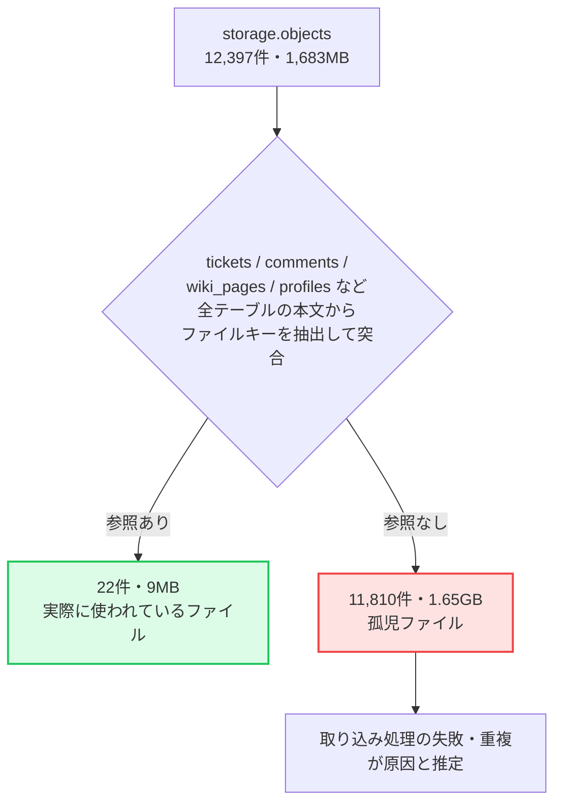

課題管理SaaS「[Taski（タスキ）](https://taski-app.com/?utm_source=zenn&utm_medium=article&utm_campaign=storage_quota)」を個人開発・運用している中で、ある日 Supabase のダッシュボードに **「Storage 使用量が枠の174%」** という警告が出ました。

無料プランの1GB枠に対して実測1.68GB。素直に見れば「そろそろ有料プランに上げるしかないか」という話です。

ところが中身を調べていくと、**実際にチケットから参照されていたファイルはわずか9MB**で、残りの1.6GB超はすべて「どこからも参照されていない孤児ファイル」でした。さらに削除したあとも警告バナーは消えず、そこには **Supabase の請求の仕組み特有の「期間平均」の罠**が隠れていました。

同じように Supabase の Storage を使っている個人開発者に向けて、調査から解決、そして最後まで解けなかった謎までを共有します。

---

## 1. 警告の中身を見てみる

Supabase ダッシュボードの使用量ページにはこう出ていました。

> Storage Size: 1.74 GB / 1 GB（174%）

Free プランは複数プロジェクトを1つの組織にまとめて集計するため、まず自分のプロジェクトの `storage.objects` を直接見てみました。

```sql
SELECT bucket_id, count(*), pg_size_pretty(sum(metadata->>'size')::bigint)
FROM storage.objects
GROUP BY bucket_id;
```

結果、チケットの添付ファイル用バケット `ticket-attachments` だけで **12,397件・1,683MB** ありました。ファイル名を眺めていると、明らかにおかしな偏りに気づきます。

```
clipboard-202410171011-kidjx.png   → 383件
hennge_secure_download.pdf         → 156件
```

同じ元ファイルが、名前だけ変えて（アップロード時に `<ミリ秒>_<乱数>_<元ファイル名>` という形式になる仕様のため）何百件も重複していました。アップロード日を見ると特定の2日に集中しており、**Redmineからの移行データを取り込む処理を、何度か繰り返し実行した際の残骸**だろうと当たりをつけました。

---

## 2. 「参照されているファイル」を数え直す

ここで問題になるのは、**「本当に必要なファイルなのか、取り込み失敗の残骸なのか」を機械的に見分ける方法**です。うかつに全部消すと、実際に業務で使われているファイル（ファイル名からして実在の企業の業務ファイルらしきものも含まれていました）まで失いかねません。

チケット・コメント・Wikiページなど、添付ファイルのURLを保持しうるテーブルをすべて洗い出し、本文を文字列として結合してから、ファイル名の先頭キー（`\d{13}_\w+?_` の形式）を正規表現で抜き出し、`storage.objects.name` と突き合わせる方式にしました。



最初、この突き合わせを1本のSQLでJOINしようとしたところ、添付情報がJSON配列としてカラムに埋め込まれている構造だったこともあり、SQLエディタがタイムアウトして終わりませんでした。**ファイル名の配列を先に作ってから突き合わせる**形に変えたところ、無事に集計できました。

結果は次のとおりです。

| | 件数 | 容量 |
| :--- | ---: | ---: |
| 参照あり（実際に使われている） | 22件 | 9MB |
| 参照なし（孤児ファイル） | 11,810件 | 1.65GB |

**全体の99.8%が孤児ファイルだった**ということになります。

---

## 3. なぜ孤児ファイルが生まれたのか

原因を推定すると、Taskiの「プロジェクトを削除すると添付ファイルも一緒に消す」処理は、**削除するプロジェクトのチケットに紐づいている添付ファイルのURLを、tickets テーブルから逆引きして消す**という作りになっていました。

これ自体は正しい設計に見えます。しかし裏を返すと、

- 取り込み処理の途中で失敗し、**ファイルはStorageにアップロードされたが、tickets テーブルに紐付けられなかった**もの
- 一度紐付いた後、**別の理由で参照が消えた**もの

は、どちらも「逆引きの起点となる行がそもそも存在しない」ため、削除処理の対象から永遠に外れてしまいます。移行データの取り込みを試行錯誤しながら繰り返していた自分自身が、結果的に大量の孤児ファイルを生み出していた、というオチでした。

---

## 4. 削除後、警告バナーが消えない

参照なしの11,810件を Storage API（`service_role` キー）経由で削除し、実体は **22件・11MB** まで減りました。ここで一件落着かと思いきや、**ダッシュボードの警告バナーは消えないまま**でした。

理由は、Supabaseの請求指標が **「期間中の平均値（GB-Hrs）」** で計算されているためです。請求サイクルの開始直後の数日間、実体が1.6GB台だった時間が長く続いていたため、その後まとめて削除しても、サイクル終了までの平均値はすぐには下がりません。

```
請求サイクル開始 ─┬─ 1.6GB台が数日続く ─┬─ 削除（実体は0.01GB台に）
                  │                     │
                  └── ここまでの平均が高い ──┘── ここから平均が下がり始める
```

削除した直後に確認しても「まだ1.75GB」と表示されていたのはこのためで、慌てて何か見落としているのではと調べ直しましたが、単に平均が下がりきるのを待てばよいだけでした。実際、数日後に確認すると平均は1GBを切り、警告の対象からも外れていました。

---

## 5. もう一つの謎：前サイクルの超過理由は結局わからなかった

ダッシュボードの警告文をよく読むと、実は今回の「Storage 174%」は本題ではなく、こう書かれていました。

> went over its quota in the previous billing cycle (**Egress Exceeded**)

つまり**前の請求サイクルでEgress（データ転送量）が超過した**ことが猶予期間の理由で、Storageの数字はたまたま同時に見えていただけでした。

「では前サイクルに何がEgressを消費したのか」を確かめようとしましたが、ダッシュボードで遡れるのは**今サイクルと直前サイクルまで**で、肝心の「超過したとされるサイクル」のデータはもう見られませんでした。

同じ組織に同居しているもう一つの個人開発プロダクトで、画像をBase64エンコードしてデータベースに直接保存していた実装を見つけ、「これが怪しい」と直して様子を見たのですが、後から実測すると**そちらの転送量は全体の数%程度しかなく、原因として説明がつきませんでした**。結局、

- 途中で削除した別プロジェクトの使用量が集計から消えた
- あるいはさらに前のサイクルの話だった

のどちらかだろう、というところまでしか絞り込めていません。**「直した」と思った修正が的外れだったと、後から実測で気づいた**という、あまり格好のよくない顛末ですが、正直に記録しておきます。幸い、以降のサイクルではどの指標も超過ゼロで推移しており、実害は出ていません。

---

## 6. まとめとチェックリスト

Supabaseの無料プランは、Storageの実体だけでなく**取り込み処理の失敗が積み上げるゴミ**や、**期間平均という指標の遅延**によって、実態とズレた警告を出すことがあります。

同じようにデータ移行・一括取り込み機能を持つSaaSを個人開発している方は、以下をチェックしてみてください。

### 🔍 Storage孤児ファイル点検リスト
- [ ] **取り込み・移行処理は、失敗時にアップロード済みのファイルを消す設計になっているか？**
  - 「ファイルを上げてからDBに紐付ける」順序だと、失敗時に孤児ファイルが残りやすい
- [ ] **「参照されているファイル」を定期的に棚卸しする手段があるか？**
  - JOINが重くなる場合は、ファイル名の配列を先に作ってから突き合わせると軽くなる
- [ ] **ダッシュボードの警告が「今の実体」ではなく「期間平均」である可能性を疑ったか？**
  - 削除直後に数字が動かなくても、慌てて別の原因を探し始める前に数日待って確認する
- [ ] **警告に書かれている超過の対象指標（Storage / Egress / DB Size）を取り違えていないか？**
  - 目立つ数字（174%）につられて、本題（前サイクルのEgress超過）を見落としやすい

---

### プロダクト紹介
この記事で紹介した課題管理SaaS「**[Taski（タスキ）](https://taski-app.com/?utm_source=zenn&utm_medium=article&utm_campaign=storage_quota)**」は、Redmineの良さを引き継ぎながらモダンなUI/UXを実現したプロジェクト管理ツールです。

登録不要・1秒で起動するデモ画面で、実際の操作感を試すことができます。ぜひ触ってみてください。

👉 **[Taski のデモを今すぐ試してみる（登録不要・1秒で起動）](https://taski-app.com/?utm_source=zenn&utm_medium=article&utm_campaign=storage_quota)**
