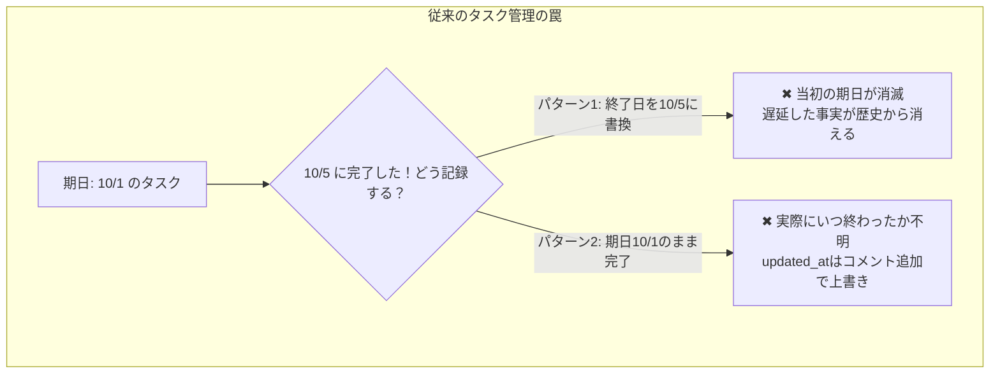
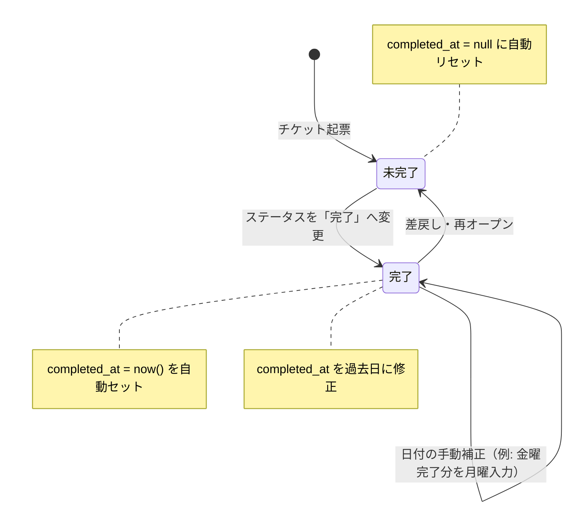
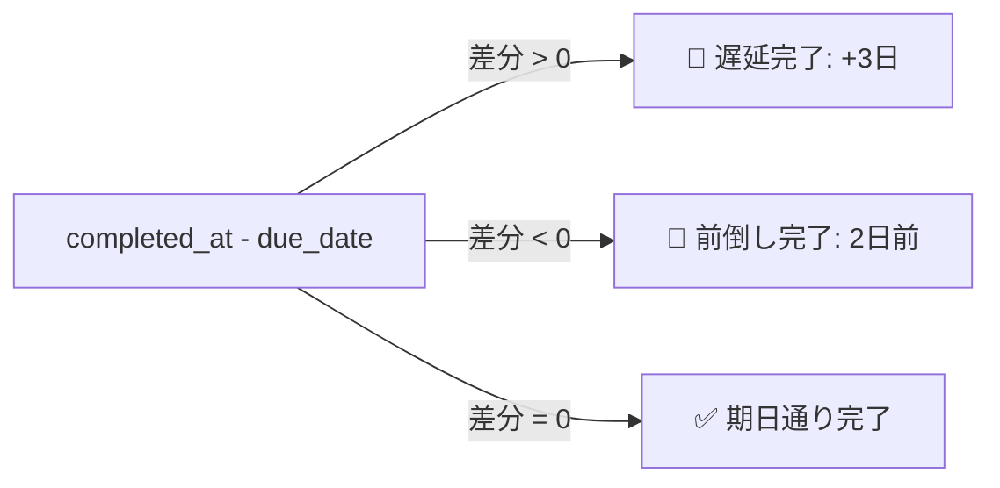

タスク管理やプロジェクト管理ツールを自作、あるいは現場で長年運用していて、こんな違和感を抱いたことはないでしょうか？

> **「チケットの『終了日』って、目標の締切（期日）のこと？ それとも実際に終わった日（実績日）のこと……？」**

Redmineをはじめ、多くのツールでは「開始日」と「期日（または終了日）」という2つの日付フィールドしか用意されていないことが珍しくありません。

その結果、現場では次のような「**データの歴史修正**」または「**実績の喪失**」というジレンマが日常的に発生しています。



どちらを選んでも、スプリントの振り返りや「プロジェクトがなぜ遅延したのか？」を分析するための予実データが破綻してしまいます。

筆者が開発しているプロジェクト管理SaaS「**[Taski（タスキ）](https://taski-app.com)**」でも、ユーザーから「期日を過ぎて終わったチケットが、ただ完了扱いになるだけで、どれくらい遅延したのか後から振り返れない」という声をいただきました。

そこで今回、 **「目標期日（`due_date`）」と「実績完了日（`completed_at`）」を完全に分離し、ステータス変更と連動させながら現場の入力ストレスゼロで遅延を可視化する仕組み** を設計・実装しました。

本記事では、その具体的なデータベース設計、ステータス自動連動のステートマシン、Reactでの楽観的UI更新、ガントチャート上での可視化手法まで、泥臭い工夫を含めて全コード・設計を解説します。

---

## 1. なぜ「期日」と「完了日」は混同されてしまうのか？

根本的な原因は、多くのツールでチケットのデータモデルが「スケジュール管理（カレンダー/ガント）」を最優先に設計されていることにあります。

ガントチャートのバーを描画するには、始点（`start_date`）と終点（`due_date` または `end_date`）が必要です。そのため、多くのシステムでは1つの日付カラムに「予定」と「実績」の両方の役割を背負わせてしまいました。

しかし、本来この2つは全く異なる概念です。

| 項目 | 意味 | 決まるタイミング | 変化するか |
| :--- | :--- | :--- | :--- |
| **期日 (`due_date`)** | 「いつまでに終わらせるべきか」（目標・締切） | タスク着手前・計画時 | 納期変更がない限り固定 |
| **完了日 (`completed_at`)** | 「実際にいつ作業が終わったか」（実績） | 作業完了の瞬間 | 事実なので不変 |

この2つを単一のフィールドで運用しようとすると、次のような問題が起きます。

1. **予定の破壊**: 実際の完了日に合わせて日付を更新すると、「元の計画からどれだけズレたのか」が比較できなくなる。
2. **`updated_at` での代用が不可能**: 「DBの `updated_at` を完了日と見なせばいいのでは？」と考えがちですが、完了後に誰かがコメントを投稿したり、タグを付け替えたりするだけで `updated_at` は現在時刻に更新されてしまいます。

結論として、 **「実績完了日時を保持する専用カラム（`completed_at`）」を独立して持たせること** が唯一の解決策になります。

---

## 2. データベース設計とマイグレーション

PostgreSQL（Supabase）におけるテーブル設計はシンプルですが、実運用に耐えうるいくつかの工夫を施しています。

### カラム追加とインデックス設計

```sql
-- 1. tickets テーブルに実績完了日時カラムを追加
ALTER TABLE public.tickets
  ADD COLUMN IF NOT EXISTS completed_at TIMESTAMPTZ;

COMMENT ON COLUMN public.tickets.completed_at IS
  'チケットの実績完了日時（ステータス完了時に自動設定、手動調整可能。未完了時はNULL）';

-- 2. 検索・完了日ソート・集計高速化用インデックス
CREATE INDEX IF NOT EXISTS idx_tickets_completed_at ON public.tickets(completed_at);
```

#### DATE ではなく TIMESTAMPTZ にする理由
日単位の管理であっても、タイムスタンプ型（`TIMESTAMPTZ`）を採用しています。
* 「10月7日 18:30」に完了ボタンが押されたという正確な時刻を残すことで、 **日をまたいだ直後の作業かどうかの判定** や、将来的なリードタイム（着手から完了までの所要時間）計測に活用できます。
* UI上ではユーザーのローカルタイムゾーンに応じて `YYYY-MM-DD` 形式に整形して表示します。

### 既存完了チケットへのバックフィル（初期移行）

既存のプロジェクトですでに何千件ものチケットが「完了」ステータスになっている場合、新規カラムはすべて `NULL` になってしまいます。
これらを救済するため、プロジェクトのステータス定義（`is_closed = true`）と突き合わせて `updated_at` から初期値を補完するワンライナーを用意しました。

```sql
-- 既に完了ステータスのチケットで completed_at が未設定のものを updated_at でバックフィル
UPDATE public.tickets t
SET completed_at = t.updated_at
FROM public.project_statuses ps
WHERE t.status = ps.key
  AND ps.project_id = t.project_id
  AND ps.is_closed = true
  AND t.completed_at IS NULL;
```

---

## 3. ステータス変更と連動するステートマシン

ユーザーに「チケットを完了したら、完了日も入力してください」と強制すると、入力の手間が増えて誰も運用しなくなります。

**「ステータスを『完了』にした瞬間に、自動で現在時刻が入る」「でも手動で修正もできる」** という体験が不可欠です。



### TypeScript / React Context での実装

Taski の `DataContext.tsx` では、チケット更新（`updateTicket`）ハンドラの中でステータスの変化を検知し、`completed_at` を自動制御しています。

```typescript
// src/context/DataContext.tsx の抜粋

const updateTicket = async (id: string, updates: Partial<Ticket>) => {
  const existing = tickets.find((t) => t.id === id);
  if (!existing) return;

  const now = new Date().toISOString();

  // ステータス変更時に completed_at を自動連動（明示的に指定がない場合）
  if (updates.status !== undefined && updates.status !== existing.status) {
    const isNowClosed = isClosedStatusKey(statuses, updates.status);
    
    if (updates.completed_at === undefined) {
      // 完了ステータスになったら現在時刻を自動記録、未完了に戻ったら null にリセット
      updates.completed_at = isNowClosed ? now : null;
    }
  }

  // 楽観的UI更新（Optimistic UI）で画面を即時書き換え
  setTickets((prev) =>
    prev.map((t) => (t.id === id ? { ...t, ...updates, updated_at: now } : t))
  );

  // バックグラウンドで Supabase を更新
  const { error } = await supabase.from('tickets').update(updates).eq('id', id);
  
  // エラー時はロールバック
  if (error) {
    rollbackToBaseline();
  }
};
```

#### 「月曜の朝に金曜日の完了を記録したい」問題の解決
現場で非常によくあるのが、「**先週の金曜日に作業が終わっていたのに、チケットを完了にし忘れて月曜日にクローズした**」というケースです。

自動設定だけで手動編集を塞いでしまうと、月曜日の日付で記録されてしまい、「締め切りを過ぎて遅延した」という誤った記録が残ってしまいます。
そのため、詳細モーダル（`TicketDetailModal`）には「完了日」のカレンダーピッカーを配置し、ワンタップで過去日に補正できるようにしています。

---

## 4. UI / UX：遅延と前倒しを一瞬で直感把握させる

データを持たせるだけでなく、一覧やガントチャートでパッと見て伝わらなければ意味がありません。

### ① チケット一覧での「遅延完了 / 前倒し完了」バッジ

期日（`due_date`）と実績完了日（`completed_at`）を比較し、日付の差分（日数）を計算してバッジを出します。



```tsx
// 遅延日数の計算ロジック
const getCompletionBadge = (ticket: Ticket) => {
  if (!ticket.completed_at || !ticket.due_date) return null;

  const compDate = parseISO(ticket.completed_at.slice(0, 10));
  const dueDate = parseISO(ticket.due_date);
  const diffDays = differenceInCalendarDays(compDate, dueDate);

  if (diffDays > 0) {
    return (
      <span className="inline-flex items-center gap-1 px-2 py-0.5 rounded text-xs font-semibold bg-amber-500/15 text-amber-400 border border-amber-500/30">
        遅延完了 (+{diffDays}日)
      </span>
    );
  } else if (diffDays < 0) {
    return (
      <span className="inline-flex items-center gap-1 px-2 py-0.5 rounded text-xs font-semibold bg-emerald-500/15 text-emerald-400 border border-emerald-500/30">
        前倒し完了 ({Math.abs(diffDays)}日前)
      </span>
    );
  }
  return null;
};
```

「遅延完了」を赤（警告）にしてしまうと現場が責められているように感じてしまうため、アンバー（琥珀色/黄色）のトーンを採用し、「振り返りのための事実」として穏やかに伝える工夫をしています。

---

### ② ガントチャートでの予実ズレ可視化

ガントチャートでは、当初予定されていた期間バー（`start_date` 〜 `due_date`）に対して、実際にどこで完了したのか（`completed_at`）を視覚的にマッピングします。

1. **予定通り・前倒しの場合**: 完了した位置までバーが塗りつぶされ、目標期日以内に収まったことが一目でわかります。
2. **遅延完了の場合**: 本来の終了位置（点線）を突き破って実績完了日までバーが伸びる、あるいは実績マーカーが期日の右側にプロットされます。

これにより、「計画に対してどのタスクでボトルネックが発生したのか」が、プロジェクト全体のタイムライン上で一目瞭然になりました。

---

## 5. CSVインポート/エクスポートでのデータ完全性

RedmineやBacklog、Jiraなどの外部ツールからTaskiへ乗り換える際にも、この完了日が欠落しないように配慮しています。

* **CSVインポート**:
  ヘッダーに「完了日」「実績日」「Completed At」「Closed On」などの列があれば自動検出し、`completed_at` へマッピング。
* **CSVエクスポート**:
  「期日」と「完了日」を別々の列として出力することで、ExcelやBIツールでの予実分析（スループット・サイクルタイム集計）にそのまま利用できます。

---

## まとめ：データモデルの誠実さがツールの信頼性を生む

タスク管理ツールにおいて、「期日」と「完了日」を混ぜてしまうのは、実装としては手軽ですが、 **プロジェクトの貴重な履歴データを壊してしまうトレードオフ** を抱えています。

* **目標期日（`due_date`）**: チームが目指したゴール
* **実績完了日（`completed_at`）**: 現場が実際に成し遂げた事実

この2つを明確に分けることで、
1. 誰も歴史を書き換える必要がなくなり、
2. ステータス変更だけで勝手に実績が蓄積され、
3. 「どれくらい遅れたのか / 前倒しできたのか」をチームで気持ちよく振り返れるようになりました。

個人開発のSaaSであっても、現場のリアルな運用とデータモデルの整合性に徹底的に向き合うことが、プロダクトの使い心地に直結すると実感しています。

---

### 実際に触って試せます 🚀

この記事で紹介した「期日と実績完了日の分離管理」「遅延完了バッジ」「ガントチャートでの予実可視化」は、筆者が開発している **Taski（タスキ）** のデモ環境で今すぐ体験できます。

アカウント登録不要・1秒で立ち上がりますので、ぜひ触ってみてください！

👉 **[Taski（タスキ）のデモを試してみる](https://taski-app.com)**
